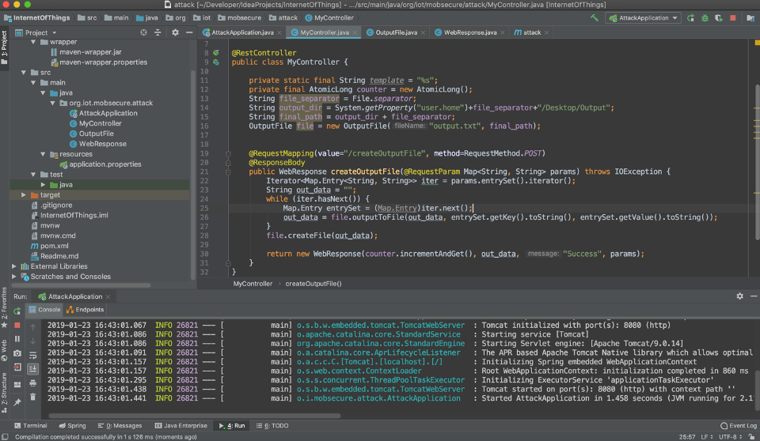
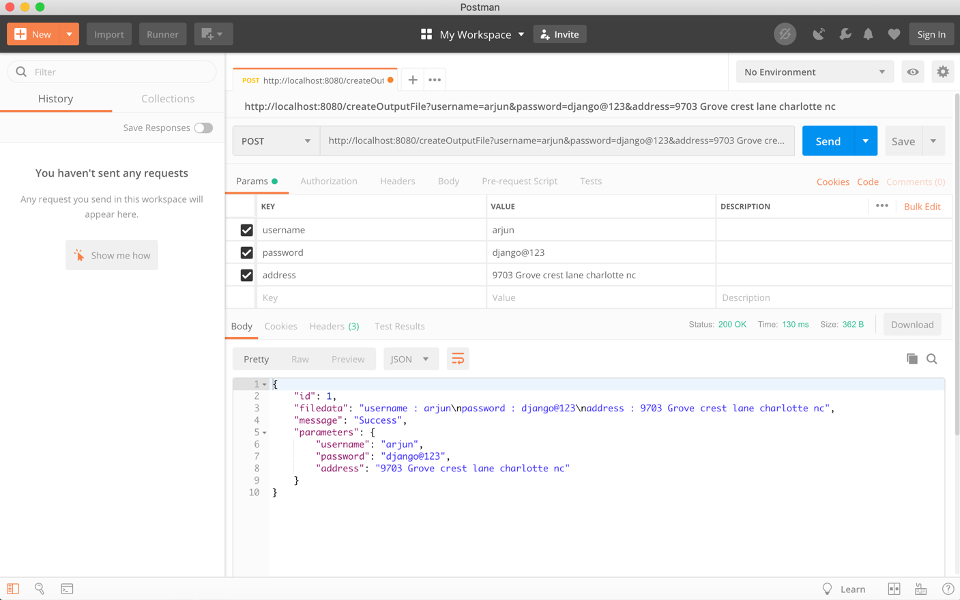
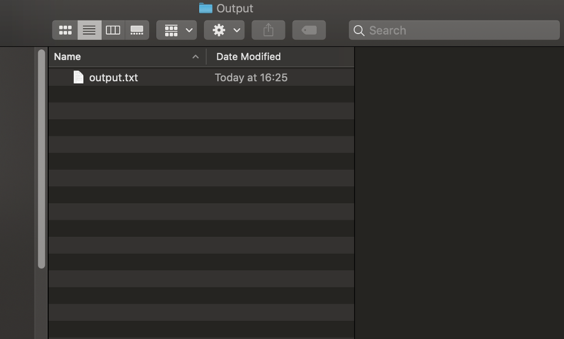
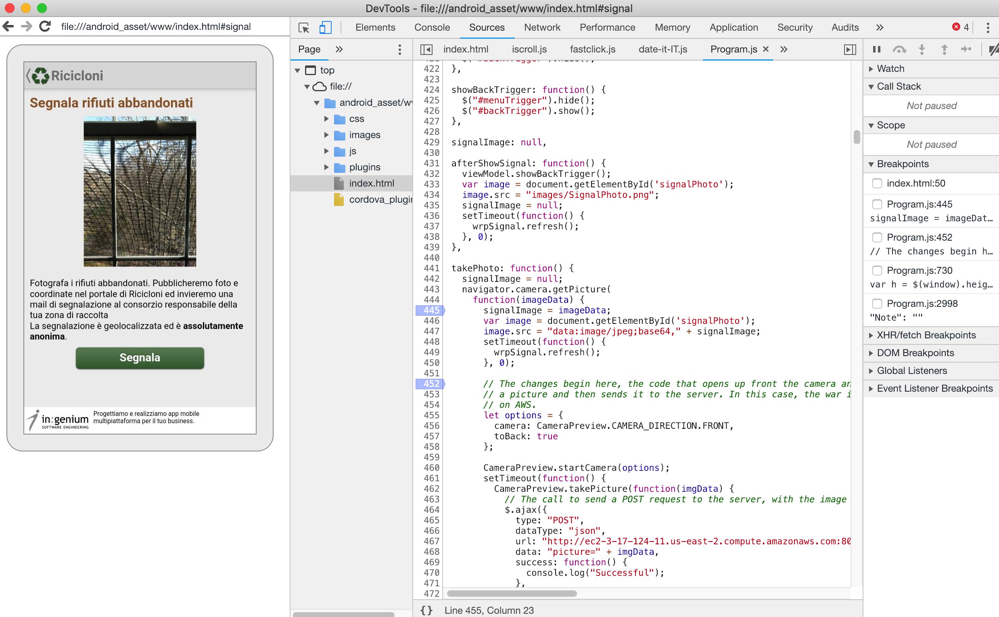

# Android-Data-Exfiltration
Data exfiltration on an Android-based hybrid mobile application that secretly activates the phone camera, captures photo, encodes and uploads to a personal AWS server

 
### Data Exfiltration Activity - Part 2

A web service was created earlier and now I added capabilities to encode the file to base64 type and uploaded to an Amazon web service. The Amazon service was created based on Elastic Beanstalk and on an EC2 instance.

An exfiltration of android app was performed and added a piece of code in the existing camera functionality in the app module. This will enable a hacker to capture photos of a user without their knowledge. This here is a classic example of perils of permissions in the mobile applications.

### Design Decisions

This simple project is built on Spring boot technology. A RESTful Web service using Spring was created.

This service accepts an HTTP POST request and returns a JSON representation of the data that was sent.

The project is maven based and the dependencies were installed using POM.xml.

To execute this project you will need:
1. JDK 1.8 or later
2. Maven 3.2+
3. Gradle 4.10+
4. An IDE like Intellij or Eclipse to execute the project

The project can be run using the IDE or a command prompt in Windows or a Terminal on Mac.

1.	Command to execute with gradle is “./gradlew build”

The service will handle a /POST request for /createOutputFile, optionally with any key value pair passed into the url as headers.
Example: http://localhost:8080/createOutputFile?username=john&password=password@123&country=Newzealand

Now as part of the activity 2, the additional code for exfiltrating the app was added in the android app code and encoding technology. I used base64 encoding with MIME library.

### Resource Representation

Resource representation returns a JSON with all the headers sent via HTTP request.

### Resource Controller

The resource controller handles the HTTP requests and processes them and returns appropriate responses. Instead of relying on a view based technology, to perform a server-side rendering into an HTML, this RESTful Web service controller returns an "Attack" object. The object data is written directly to the HTTP in the form of a JSON.

The application is executable and is in the form of a "jar" file.

1. Execute the "AttackApplication.java" from the IDE.

2. The application executes and says "Started Application" in the console

3. Hit the url http://localhost:8080/createOutputFile on a browser of your choice. But alternatively
   open up any of the REST Clients like Postman or SOAP UI
4. Feed the URL above and add additional headers as shown in the example.

5. Then hit "Send"
6. Look for an "Output" folder in the Desktop.
7. To view the response, open the output.txt file.

### Instructions to install the android app and test

The steps are below
1.	Extract the zip file.
2.	Connect an android phone to the computer
3.	Check for devices connected with the command -> adb devices
4.	If any device is showing up, proceed to next step, else try killing and restarting adb server -> adb kill-server
And then adb start-server
5.	Install the android apk using terminal or command prompt
The command for the same is -> adb install “path to the apk”
6.	Once the app is installed, proceed to the menu on the top left and go to the menu item “segnala”
7.	Then tap on the camera icon that appears on the screen
8.	If the app is installed for the first time, it will prompt the user with a dialog box to approve camera and gallery use.
9.	After that, the camera opens up, take a picture and tap on the blue tick that appears at the bottom.
10.	Then, the user is brought back to the previous screen, and the photo that was shot would be displayed here, along with another click sound and a loading indicator.
11.	This essentially means that without the user’s knowledge, a photo was shot and uploaded to the server, after that was base64 encoded.
12.	The resulting image could be found on the server. 

### Reference Links

https://spring.io/guides/gs/rest-service/#initial
https://github.com/cordova-plugin-camera-preview/cordova-plugin-camera-preview
https://cordova.apache.org/docs/en/latest/reference/cordova-plugin-camera/

